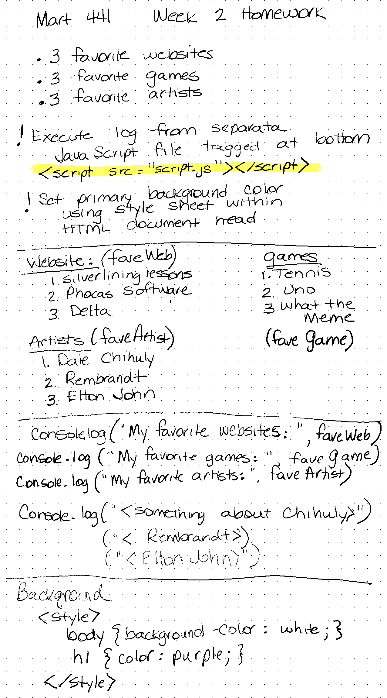

# MART 441Week2Homework
---
Base URL for site: [https://github.com/christinebmartin/MART441_Spring24] 
I spent a good part of my time refreshing my memory on what was covered in MART341.  
I have downloaded the Codeacademy App on my phone which has been a good way to refresh skills. 
I created variables where the list arrays were contained. 
I then combined a heading to the variables.
Lastly, I added commentary on favorite artists. 
I'm still a bit confused as to why something would be written to the Log, but I'm sure this will become more evident as we work through things. 
Including my planning page for Homework 2 

Using ChatpGPT to create the files I found the file to be much more simple than what I created.  I used variables to identify the console log items, however ChatGPT had each one listed:  
// Log your favorite websites
console.log("Favorite Websites:");
console.log("1. ExampleWebsite1.com");
console.log("2. ExampleWebsite2.com");
console.log("3. ExampleWebsite3.com");

If I had used the ChatGPT output I would have accomplished what the assignment required, however it would be quite generic. Because the output was so generic I would have been able to explain the code adequately.  I do not as though this would be reflective of my work though.